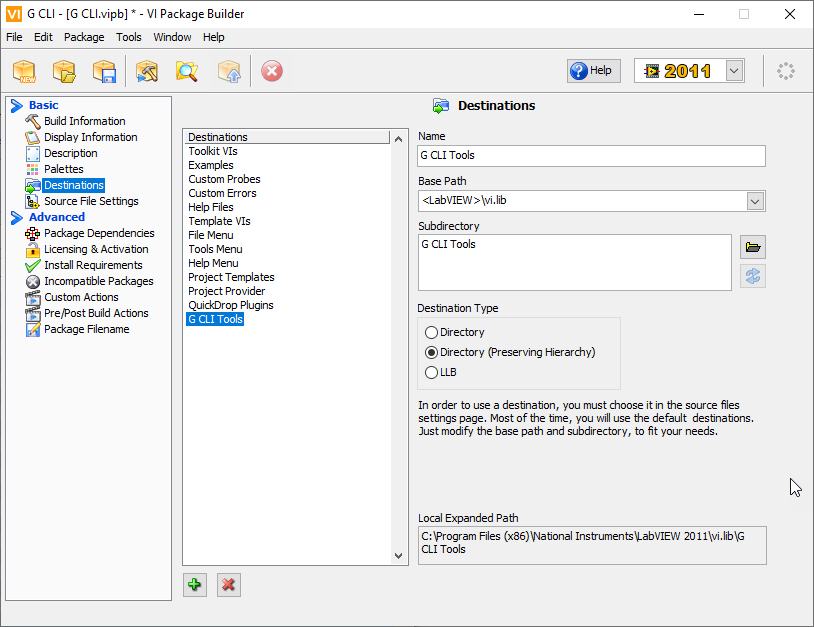

# Creating Tools Process

## Code and VI Setup

First, create a VI that does what you want using the CLI library. Avoid dialogs or dependency on UIs.

Then ensure it runs when opened in VI properties.

Finally consider what happens when it ends. Options are:

* Nothing - just leave it open. Generally no harm in this if it is for a server.
* Close the VI - This should get you back to the LabVIEW splash screen. This seems to make the most sense as long as you aren't scripting changes that might cause save dialogs. (EDIT: This can also trigger a save dialog if an upgraded G CLI causes a recompile, think nothing might be better)
* Exit LabVIEW - Generally discouraged in CI use cases as it wastes time relaunching LabVIEW.

## Setup Installer

This step is if you want the ability for G CLI to find it automatically in it's search path.

* Create a VIPB using VI package manager and enter all your details for the product.
* Create a new destination called G CLI Tools. Set the base path to <LabVIEW>\vi.lib and make the subdirectory "G CLI Tools". You can add your own subdirectory as well. So if your tool is called "tool.vi" and you have it under "G CLI Tools\wiresmith" it can be called with "wiresmith\tool". This may make sense for a full set of tools.

* Go to source file settings. Set your tool VIs to the G CLI Tools destination. Other VIs can remain in their own directory.
* Be sure to include G CLI as a dependent package along with any other dependencies so this becomes a one-shot install.
* Build and install the package.

## Testing

Install your package and run G CLI with the name of your VI (it works even without the extension) - it should run successfully.