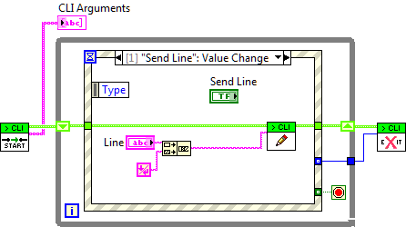

# Getting Started

## Basics

G CLI is a command line tool which communicates with a special library in your LabVIEW application or VI in order to add the ability to return standard output and exit codes which is very difficult or impossible otherwise.

## VI Setup

The VI you call should:

1. Have the G CLI library included to initiate the connection to the command line and communicate back to it. This is a very simple API with a connect, write and exit (with exit code) pattern.  

2. Be set up to run on launch (if being run as a VI, not an executable).

As this suggests you can use this to call VIs in the LabVIEW environment OR once built into an executable.

## Launching a VI

Before launching a VI you should ensure LabVIEW will launch without any dialogs. The best thing is to open the VI manually and see if any dialogs come up. Examples are missing VIs or licensing dialogs. These will stop LabVIEW from running your code and must be corrected first.

To launch a VI in LabVIEW 2014 you then enter the command `g-cli --lv-ver 2014 "C:\nameofvi.vi"`. For the 64 bit version add the --x64 flag e.g. `g-cli --lv-ver 2014 --x64 "C:\nameofvi.vi"`

To launch a VI which has been built into an executable you can just provide the exe path e.g. `g-cli "C:\nameofvi.exe"`. The program will detect the .exe extension and launch it directly (note: there was a bug in this in at least v1.4-v1.5. Update to v1.5.1 to use this mode).

If you want to provide your own command line parameters to your VI place them after a -- e.g. `g-cli --lv-ver 2014 "C:\nameofvi.vi" -- "parameter 1" "parameter 2"`. The quote marks tell Windows to ignore the spaces so it doesn't generate 4 parameters.

## Demo

There is an example VI that ships with the tool for you to try it out. To launch it call:

`g-cli --lv-ver <LABVIEW_VERSION> "<LABVIEW_DIR>\examples\Wiresmith Technology\G CLI\CLI Demo.vi" -- "demo 1" "demo 2"`

Then run the VI when it launches. This does not have auto-run set intentionally so you can see what happens if the code doesn't run (the interface times out) and can easily inspect the code.

## Full Command Line Interface

The command line contains a number of settings you can use for more advanced features:

`g-cli [options] launch-vi [-- application arguments]`

last argument (or last before -- if user arguments) is what to launch. This can be a local VI, LabVIEW build executable or it will search in "<vi.lib>\G" CLI Tools for a matching tool.

### Basic Flags 

| flag | description |
|------|-------------|
|--version | Prints the program version and exits. Useful for checking the install is correct.|
| -v or --verbose | Verbose mode. Very useful for debugging problems.|
|--lv-ver | LabVIEW version to use e.g. 2015 |
| --x64 (will be deprecated) | Launch in 64 bit LabVIEW |
| --arch | 32 or 64 to define the bitness of LabVIEW to launch (since v3.0.0) |
| --timeout | Maximum time (in ms) to wait for the LabVIEW program to connect to the CLI (-1 = Infinity). |

Any arguments after -- are passed to the application.

### Advanced Usage

| flag | description |
|------|-------------|
| --kill | Forces the LabVIEW process to exit after the CLI receives a return code/error. Useful in CI systems to ensure LabVIEW has fully closed on completion. |
| --kill-timeout | Time to wait after exit code before killing LabVIEW process (so it has the chance to close itself). Default 10000ms (10 seconds) (from version 2.3.0) |
|--no-launch | Doesn't launch anything automatically, you must run your software manually. Overrides --timeout to -1.|
| --lv-exe | **DEPRECATED IN 2.0** LabVIEW Executable to use. Only require if --lv-ver won't detect your LabVIEW install for some reason. |
| --allowDialogs or --allow-dialogs (v3.0) | By default, we set the unattended flag when launching LabVIEW to reduce the risk of dialogs. Set this to remove that function. Use --allow-dialogs from version 3.0 (from version 2.2.0) |

# Platform Considerations

## Linux

On Linux return codes are in the range of 0-255. Setting exit codes outside of this range will result in exit codes that don't match what is set in LabVIEW.

