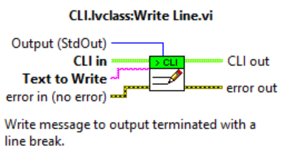
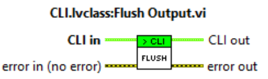

# LabVIEW Library

The LabVIEW interface library allows you to communicate with the command-line interface that launched the VI.

## Start CLI Interface

This establishes the connection back to the command line and provides you with the working directory of the command line and any parameters provided to the VI.

## Write String

Writes the text back to the stdout of the command line. Note: you have to include your own new line characters and so may require the Flush Output VI afterwards.

## Write Line

Writes the text to the selected output buffer and terminates it with a line ending.

## Flush Output

Flushes the output buffer to the command line. This isn't required if you write lines to the buffers as they will automatically flush.

However, for more advanced scenarios, you may need to flush the output buffer manually.

## Path From Parameter

Takes the working directory and a parameter which represents a file and converts it to an absolute path for access.

## Exit With Code

Close the connection to the command line and force the command line application to exit with the code provided. 

## Exit with Error Cluster Code

Like Exit With Code but instead, this will inspect the error cluster and if there is an error, output a text description and exit the command line with the error code.
